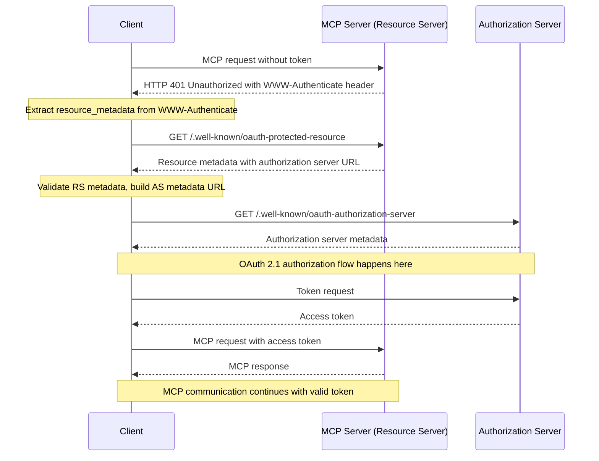
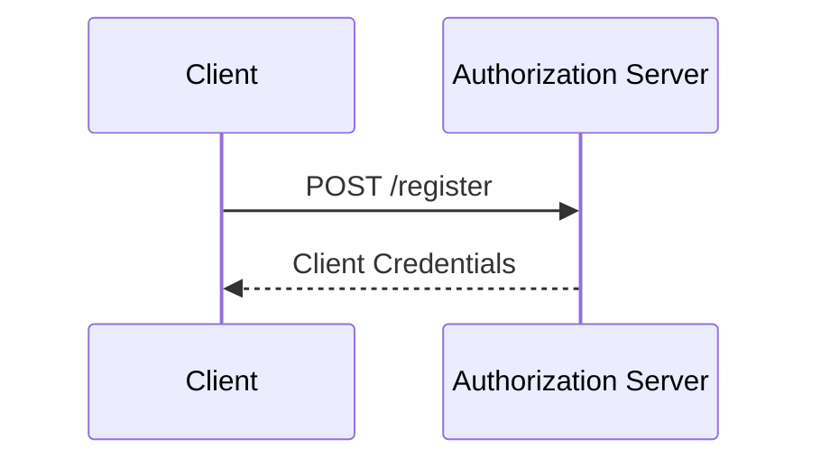

# OAuth 2.1 Remote Gmail MCP Server

This is a Next.js-based application that serves as a proof-of-concept of a remote MCP server with OAuth 2.1 authentication support. The server uses the `@vercel/mcp-adapter` to handle the MCP protocol, supporting both SSE and Streamable HTTP transports.

## Introduction

[Model Context Protocol](https://modelcontextprotocol.io/) (MCP) is a new protocol that standardizes how LLM-based clients can programmatically interact with applications. This includes querying data (resources) or taking direct actions (tools).


>[!NOTE] 
> How is this different from other Gmail MCP servers?
>
> With this server, users do **not** need to bring their own Google API keys or set up their own Google Cloud project. Anyone can simply plug in the remote server link, authenticate with their own Google account via OAuth, and start using Gmail tools immediately. Each user authenticates securely with Google, so the server handles all API credentials and token management for you. This makes onboarding and usage much easier—just connect, sign in, and go!

> [!CAUTION]
> Not ready for production usage!
>
> This project is in active development and currently uses some hardcoded variables and plaintext tokens for development/testing purposes. Additionally, some tokens are stored in memory instead of Redis. These issues will be fixed soon. Please do not use this server for production workloads until these security concerns are addressed.

This project is intended for application developers implementing an MCP _server_ that requires authentication. The included OAuth 2.1 implementation is compatible with MCP clients and can be extended or integrated with external authorization servers.

## Features
- **OAuth 2.1 Authorization Server**: Implements client registration, token exchange, and consent screen.
- **MCP Server**: Exposes tools and resources via the MCP protocol.
- **User Authentication**: Uses Google as the default provider (via Auth.js), but can be swapped for any provider.
- **SSE and HTTP Streaming**: Supports both transports for compatibility with various clients.
- **Prisma ORM**: Persists clients, tokens, and sessions in a PostgreSQL database.


## Authorization

### Protocol Compliance

This MCP server implements the following standards:

- [OAuth 2.1 IETF DRAFT](https://datatracker.ietf.org/doc/html/draft-ietf-oauth-v2-1-12)
- [OAuth 2.0 Authorization Server Metadata (RFC8414)](https://datatracker.ietf.org/doc/html/rfc8414)
- [OAuth 2.0 Dynamic Client Registration Protocol (RFC7591)](https://datatracker.ietf.org/doc/html/rfc7591)
- [OAuth 2.0 Protected Resource Metadata (RFC9728)](https://datatracker.ietf.org/doc/html/rfc9728)
- [Resource Indicators for OAuth 2.0 (RFC8707)](https://www.rfc-editor.org/rfc/rfc8707)

### Roles

- **Resource Server** – Your MCP server (this app), acts as an OAuth 2.1 resource server.
- **Authorization Server** – The built-in OAuth endpoints, or an external server like AuthKit/Auth0.
- **Client** – MCP client, acts as an OAuth 2.1 client.

### Authorization Flow Overview

1. Authorization servers **MUST** implement OAuth 2.1 with appropriate security for confidential and public clients.
2. Authorization servers and MCP clients **SHOULD** support OAuth 2.0 Dynamic Client Registration ([RFC7591](https://datatracker.ietf.org/doc/html/rfc7591)).
3. MCP servers **MUST** implement OAuth 2.0 Protected Resource Metadata ([RFC9728](https://datatracker.ietf.org/doc/html/rfc9728)).
4. Authorization servers **MUST** provide OAuth 2.0 Authorization Server Metadata ([RFC8414](https://datatracker.ietf.org/doc/html/rfc8414)).

#### Authorization Flow Sequence Diagram



### Dynamic Client Registration

MCP clients and authorization servers **SHOULD** support [OAuth 2.0 Dynamic Client Registration Protocol (RFC7591)](https://datatracker.ietf.org/doc/html/rfc7591) to allow MCP clients to obtain OAuth client IDs without user interaction.

#### Dynamic Client Registration Sequence Diagram



### Token Verification

Your MCP endpoints must verify access tokens issued by the authorization server. This app uses Prisma to store and validate tokens. For external JWT-based servers, you can use a remote JWKS for verification.

Example (token verification in Next.js API route):
```typescript
[src/app/[transport]/route.ts](src/app/[transport]/route.ts)
async function authenticateRequest(request: NextRequest) {
  const authHeader = request.headers.get('authorization');
  // ...existing code...
  const SIMPLE_BEARER_TOKEN = process.env.SIMPLE_BEARER_TOKEN;
  if (!authHeader) return null;
  const token = authHeader.split(' ')[1];
  if (!token) return null;
  if (token === SIMPLE_BEARER_TOKEN) {
    return { token: SIMPLE_BEARER_TOKEN, user: { id: 'dev-user' } };
  }
  try {
    const accessToken = await prisma.accessToken.findUnique({ where: { token } });
    if (!accessToken) return null;
    if (accessToken.expiresAt < new Date()) return null;
    return accessToken;
  } catch (e) {
    return null;
  }
}
```

### Metadata Endpoints

Your MCP server should implement the following endpoints for client discovery:

#### `/.well-known/oauth-protected-resource`
```typescript
[src/app/.well-known/oauth-protected-resource/route.ts](src/app/.well-known/oauth-protected-resource/route.ts)
import { NextResponse } from 'next/server';
import type { NextRequest } from 'next/server';

export async function GET(request: NextRequest) {
  const baseUrl =
    process.env.NEXTAUTH_URL ||
    `${request.nextUrl.protocol}//${request.nextUrl.host}`;

  const metadata = {
    resource: `${baseUrl}/mcp`,
    authorization_servers: [baseUrl],
    scopes_supported: ["api:read", "api:write"],
    bearer_methods_supported: ["header"],
    resource_documentation: `${baseUrl}/docs`
  };

  const response = NextResponse.json(metadata);
  response.headers.set('Access-Control-Allow-Origin', '*');
  response.headers.set('Access-Control-Allow-Methods', 'GET, OPTIONS');
  response.headers.set('Access-Control-Allow-Headers', 'Content-Type, Authorization');
  return response;
}
```

#### `/.well-known/oauth-authorization-server`
```typescript
[src/app/.well-known/oauth-authorization-server/route.ts](src/app/.well-known/oauth-authorization-server/route.ts)
import { NextResponse } from 'next/server';
import type { NextRequest } from 'next/server';

export async function GET(request: NextRequest) {
  const baseUrl =
    process.env.NEXTAUTH_URL ||
    `${request.nextUrl.protocol}//${request.nextUrl.host}`;

  const metadata = {
    issuer: baseUrl,
    authorization_endpoint: `${baseUrl}/oauth/authorize`,
    token_endpoint: `${baseUrl}/api/oauth/token`,
    registration_endpoint: `${baseUrl}/api/oauth/register`,
    scopes_supported: ["api:read", "api:write"],
    response_types_supported: ["code"],
    grant_types_supported: ["authorization_code", "refresh_token"],
    token_endpoint_auth_methods_supported: ["none", "client_secret_post"],
    code_challenge_methods_supported: ["plain", "S256"]
  };

  const response = NextResponse.json(metadata);
  response.headers.set('Access-Control-Allow-Origin', '*');
  response.headers.set('Access-Control-Allow-Methods', 'GET, OPTIONS');
  response.headers.set('Access-Control-Allow-Headers', 'Content-Type, Authorization');
  return response;
}
```


## Architecture Overview
- **OAuth Endpoints**: [`src/app/api/oauth/*`](src/app/api/oauth/) (client registration, token exchange)
- **Consent Screen**: [`src/app/oauth/authorize/page.tsx`](src/app/oauth/authorize/page.tsx) (basic UI for user consent)
- **MCP Server**: [`src/app/[transport]/route.ts`](src/app/[transport]/route.ts) (main MCP handler, tool registration)
- **Authentication**: [`src/app/auth.ts`](src/app/auth.ts) (Auth.js config, Google provider)
- **Auth Route**: [`src/app/api/auth/[...nextauth]/route.ts`](src/app/api/auth/[...nextauth]/route.ts) (wires up Auth.js)

### Database
Uses Prisma ORM with PostgreSQL. You can swap for another Prisma-supported database if needed.


## MCP Server Tools & Features

The MCP server exposes a variety of tools for interacting with Gmail and performing utility operations. These tools are registered in [`src/app/[transport]/tools.ts`](src/app/[transport]/tools.ts) and are accessible via the MCP protocol.

### Utility Tools

- **add_numbers**: Adds two numbers together and returns the sum.
- **validate**: Returns the server owner's number in `{country_code}{number}` format.
- **google_auth_link**: Sends a Google OAuth sign-in link for user authentication.
- **check_google_auth**: Checks if the user is currently authenticated with their Google account (requires session cookie).
- **send_test_email**: Sends a test email using the Gmail API (requires session cookie).

### Gmail Email Tools

- **send_gmail_email**: Send an email using Gmail API with advanced options (to, subject, body, htmlBody, cc, bcc, attachments, etc.).
- **draft_email**: Create a draft email using Gmail API.
- **read_email**: Read an email by its message ID.
- **search_emails**: Search emails using Gmail query syntax (e.g., `from:example@gmail.com`).
- **modify_email**: Modify email labels (add/remove labels for a message).
- **delete_email**: Delete an email by its message ID.

### Gmail Label Tools

- **list_labels**: List all Gmail labels (system and user labels).
- **create_label**: Create a new Gmail label with custom visibility options.
- **update_label**: Update an existing Gmail label (name, visibility).
- **delete_label**: Delete a Gmail label (cannot delete system labels).
- **get_or_create_label**: Get a label by name, or create it if it does not exist.

### Gmail Batch Operations

- **batchModifyEmails**: Modify labels for multiple emails in batches (add/remove labels).
- **batchDeleteEmails**: Delete multiple emails in batches.

### Schemas & Types

All tool inputs and outputs are validated using [Zod](https://zod.dev/) schemas defined in [`src/app/[transport]/gmail/schemas.ts`](src/app/[transport]/gmail/schemas.ts). This ensures robust input validation and clear API contracts for each tool.

### Example Usage

To use these tools, clients must authenticate and provide a valid session cookie (for Gmail operations). Each tool expects specific parameters as defined in its schema. For example, to send an email:

```json
{
  "tool": "send_gmail_email",
  "args": {
    "session_cookie": "__Secure-authjs.session-token=...",
    "to": ["recipient@example.com"],
    "subject": "Hello",
    "body": "This is a test email."
  }
}
```

Refer to the schemas in [`src/app/[transport]/gmail/schemas.ts`](src/app/[transport]/gmail/schemas.ts) for detailed parameter descriptions for each tool.

---

**Note:** The MCP server is extensible. You can add your own tools to `registerTools` in [`src/app/[transport]/tools.ts`](src/app/[transport]/tools.ts) to expose new capabilities to MCP clients.

---

## Credits

- [run-llama/mcp-nextjs](https://github.com/run-llama/mcp-nextjs) — Next.js OAuth MCP implementation
- [NapthaAI/http-oauth-mcp-server](https://github.com/NapthaAI/http-oauth-mcp-server) — MCP spec authorization extension
- [GongRzhe/Gmail-MCP-Server](https://github.com/GongRzhe/Gmail-MCP-Server) — Gmail tools and inspiration
